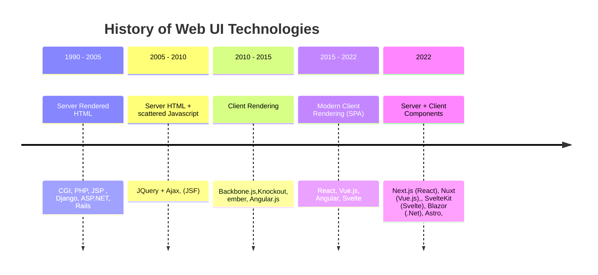

English Version below... 


Es ist wieder an der Zeit sich dem Thema der gegenwärtigen Entwicklung in der Web-Entwicklung zu widmen.
Bevor wir uns jedoch dem gegenwärtigen Trend widmen wollen wir die Vergangenheit betrachten. 
Wir beginnen mit den Anfängen der Web-Entwicklung. Zu der Zeit wurde HTML auf dem Server generiert und ausgeliefert. Frameworks wie etwa JSP , Django und Rails sind Vertreter solcher Strömungen. Danach wurden Anwendungen mit Javascript angereichert. Dies erfolgte, da die Javascript API in den Browsern noch sehr umständlich war in der Regel mit JQuery als Abstraktionsschicht darüber. Darauf folgend kamen erste Client Rendering Frameworks auf, welche mehr Strukturen unterstützen. Dadurch kam MVC and MVVM ins Frontend. Die Anwendungen wuchsen noch mehr heran und diese Ansätze kamen an ihre Grenzen. Neuere Frameworks haben dann den Komponenten-Ansatz noch mehr inkludiert und dadurch entwickelten sich Vertreter wie etwa React und Vue.js. Momentan sind die Anwendungen aber so groß, dass Performance Probleme auftreten und somit 
kommt man nun auf die Idee die Anwendungen in Server und Client basierte Komponenten aufzuteilen. Ein populärer Vertreter ist Next.js, welches auf React aufbaut. Dabei wird ein Großteil der Anwendungen wieder auf dem Server gerendert und als HTML als ausgeliefert. Nur kleine Komponenten, welche nur auf dem Client ausgeführt werden müssen, laufen dann auf dem Client. Dadurch sind die altbekannten Vorteile von statischem Content wieder nutzbar (Caching, SEO). Auch wird ein schnellerer First Load, eine Reduktion von Egress Kosten, eine bessere Kompatibilität vor allem mit Low-End Geräten, da nur HTML Rendering ausgeführt werden, erreicht. Auch gewinnt der Begriff Progressive Enhancement wieder mehr an Bedeutung.      

Diese neueren Frameworks bieten folgende Funktionen an:  


* Server Side Rendering: Das Rendern auf dem Server und das Ausliefern bloßer HTML Inhalte.

* Streaming Server Side Rendering: Rendering der groben Seitenstruktur, aufwendige Teile werden später eingefügt. 

Ein Beispiel mit Next wäre das folgende:
```next
<Suspense fallback={<Loading/>}
 <HeavyComponent>
</Suspense> 
```
* Enhanced Navigation (Enhanced Form Post): Reduktion des Reload Aufkommens bei Full-Page Requests, durch clientseitiges Ersetzen des Contents. 

* Client Components: gezielte Ausführung Inhalten auf dem Client
 Ein Beispiel in Next.js ist: 

```next
'use client'
 
import { useState } from 'react'
 
export default function Counter() {
  const [count, setCount] = useState(0)
 
  return (
    <div>
      <p>You clicked {count} times</p>
      <button onClick={() => setCount(count + 1)}>Click me</button>
    </div>
  )
}
```

Mit diesen Funktionen wird es möglich eine leichtgewichtige Benutzer-Experience u entwerfen , ohne die modernen UI Frameworks zu verlassen. 


Quellen/ Sources : 
Next Js. Streaming SSR: https://nextjs.org/docs/app/building-your-application/routing/loading-ui-and-streaming
Next Js Navigation: https://nextjs.org/docs/app/building-your-application/routing/linking-and-navigating
https://www.youtube.com/watch?v=p9taQkF24Fs&t=3468s
