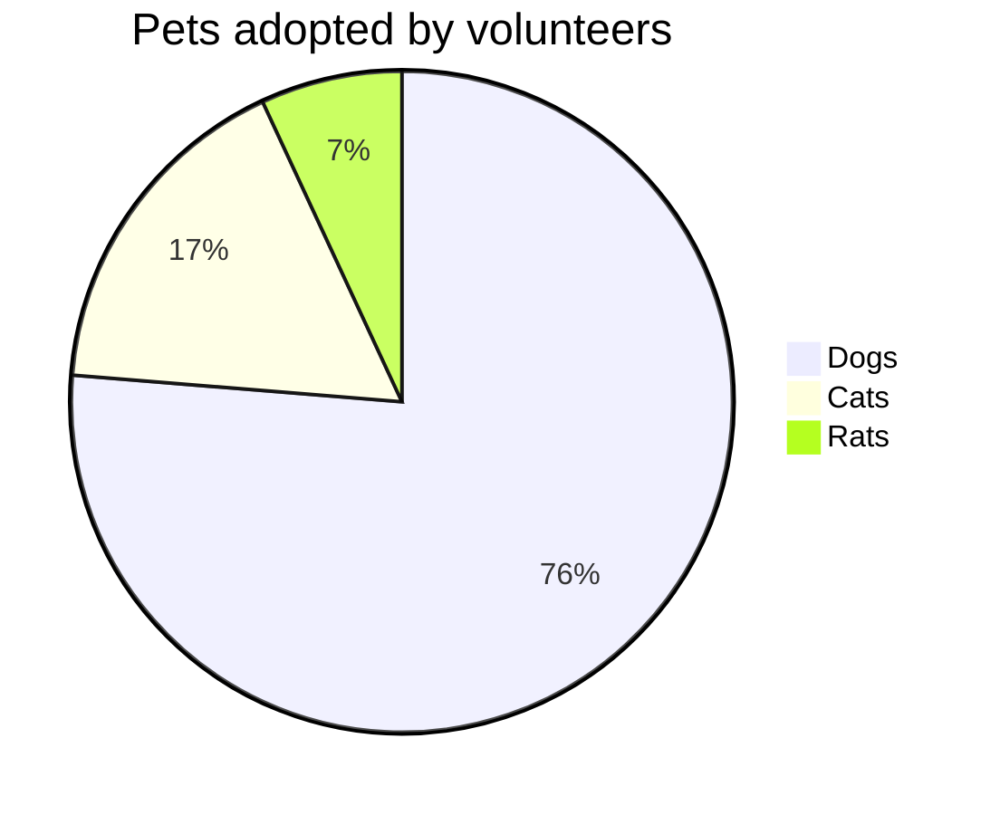

Es ist wieder an der Zeit sich dem Thema der gegenwärtigen Entwicklung in der Web Entwicklung zu widmen.
Bevor wir uns jedoch dem gegenwärtigen Trend widmen wollen wir die Vergangenheit betrachten. 
Wir aus

Documentation of software architectures is an essential part of the development process. There are numerous tools and
methods that can be used for this task, but one stands out in particular: PlantUML. In this blog post, we will discuss
the advantages of using PlantUML for describing software architectures. We will also explore extensions such as C4 and
the option of using sprites.

* Simple and Readable Syntax:
  PlantUML utilizes an easy-to-learn and readable syntax based on text. This makes it effortless to create and maintain
  architecture diagrams as they can be directly integrated into the source code. The diagrams are written in a
  text-based format, enabling easy versioning and management within a version control system.

* Platform Independence:
  PlantUML is platform-independent and can be used on various operating systems and development environments. It is
  available as a standalone application or as a plugin for development environments like Eclipse and Visual Studio Code.
  This allows developers to benefit from PlantUML regardless of their preferred development environment.

* Extensive Diagram Types:
  PlantUML offers a wide range of diagram types relevant for describing software architectures. These include class
  diagrams, package diagrams, sequence diagrams, state diagrams, and more. With this diverse set of diagram types,
  developers can describe the software architecture at different levels and from various perspectives.

* Integration of C4 Model:
  A notable extension of PlantUML is the integration of the C4 model. The C4 model is a method for describing high-level
  software architectures, based on context diagrams, container diagrams, component diagrams, and class diagrams.
  PlantUML enables the creation of C4 models using its diagram types and provides a structured approach to representing
  software architectures.

* Use of Sprites:
  PlantUML allows the use of sprites to insert custom symbols into diagrams. This is particularly useful for
  representing domain-specific elements or specific components not available in the standard notation. By using sprites,
  developers can further customize their diagrams and highlight specific aspects of their software architecture.

Conclusion:
PlantUML provides a simple, platform-independent, and comprehensive approach to describing software architectures. With
its text-based syntax, integration of the C4 model, and the option to use sprites, PlantUML opens up new possibilities
for developers to accurately describe and effectively communicate complex software architectures. By visualizing the
architecture in diagrams, collaboration among team members is improved, and potential issues can be identified early on.
